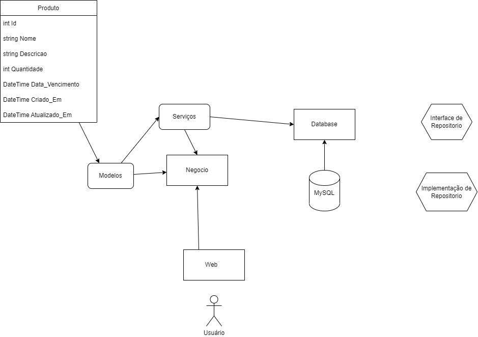
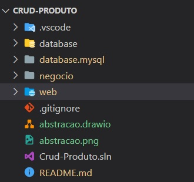
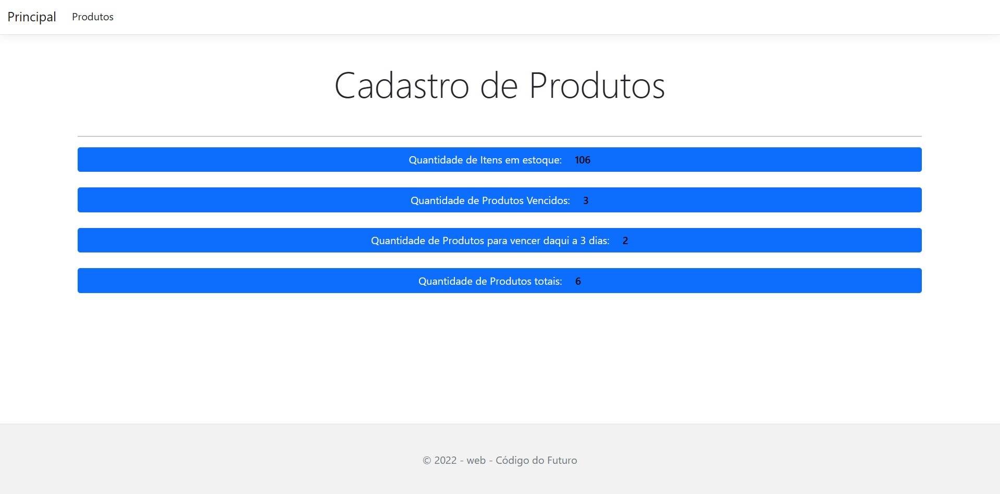
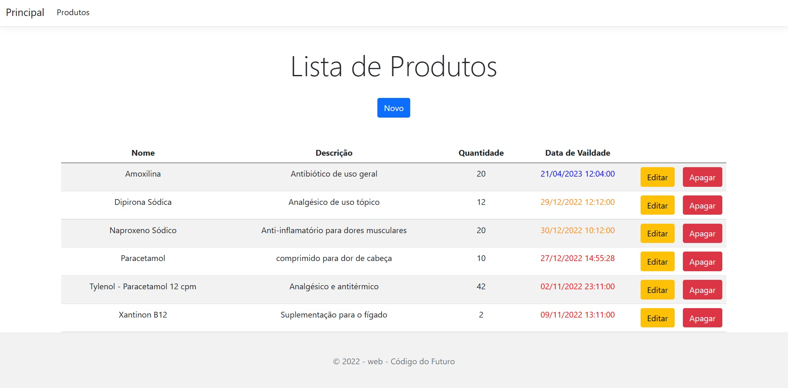
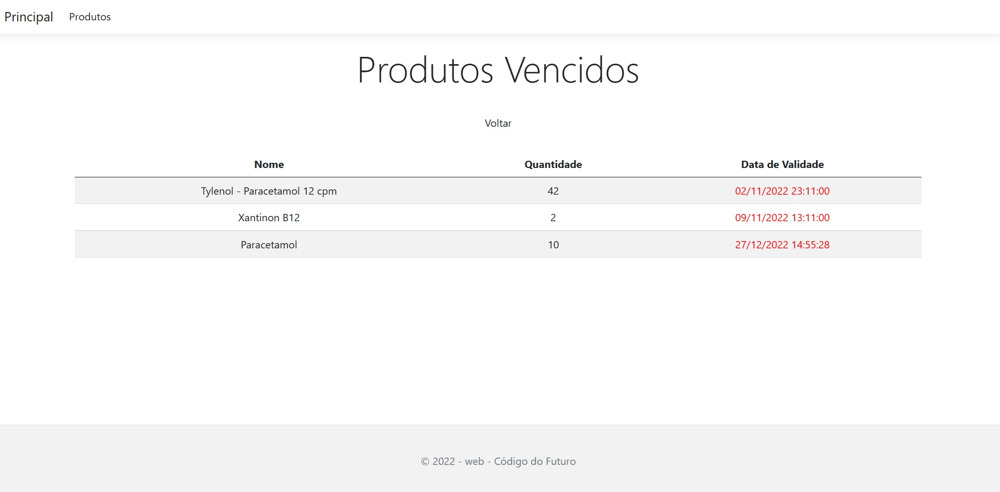
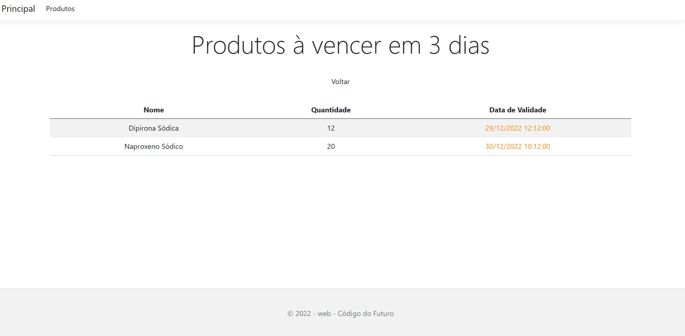
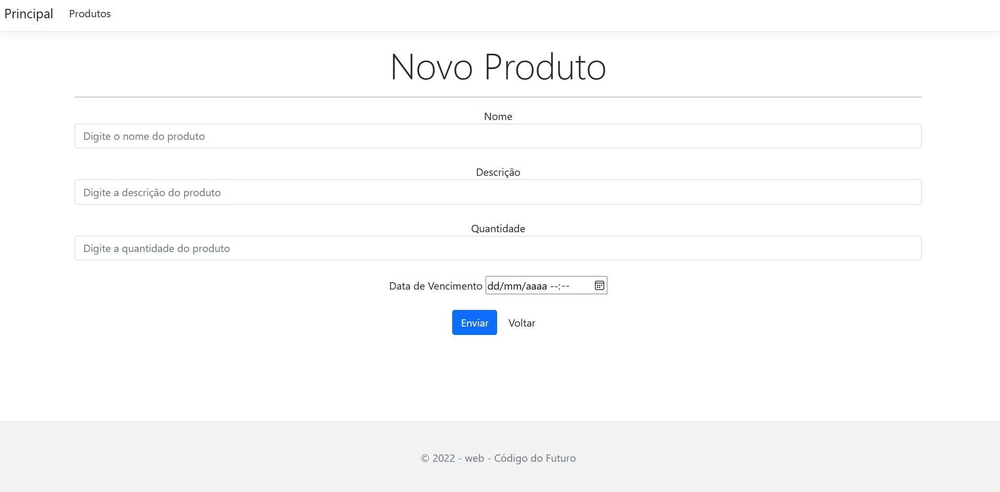
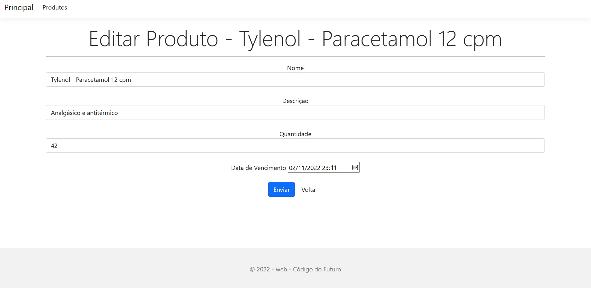
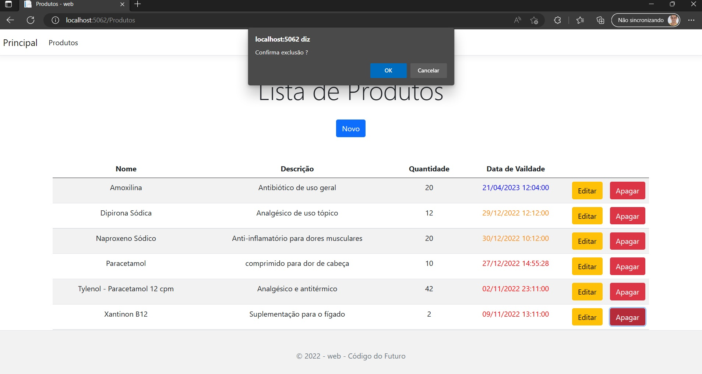

# Sistema de Cadastro de Produto

<https://user-images.githubusercontent.com/51548623/209957136-03b0c3b3-9f71-4779-b277-828613445960.mp4>

## Desafio

*Crie uma aplicação com acesso a banco de dados.
Esta aplicação tem o objetivo de fazer um CRUD (Create, Read, Update, Delete) de produtos. Os dados do modelo serão:*

- id
- nome
- descricao
- data_criacao
- data_validade
- quantidade_estoque

*Vcs irão fazer o mesmo utilizando renderização via server site com Razor.
Após o CRUD, criar algumas estatisticas para auxiliar o usuário. na home page*

- [x] Quantidade de itens em estoque
- [x] Quantidade de produtos para vencer daqui 3 dias
- [x] Quantidade de produtos vencidos
- [x] Quantidade de produtos totais

***Estes itens da home precisam ter links mostrando a lista.***
*Utilizem para trabalhar com banco de dados o MySql.Data package no NuGet*
[Danilo Aparecido - Torne se um Programador](https://www.torneseumprogramador.com.br/)

## Solução

## Abstração do Sistema

### Arquitetura Inicial

#### Tecnologias Utilizadas

- **DotNet Core - Template Razor**

:star: **[FEATURE]**: Filtro por nome do produto em ordem alfabética

:star: **[FEATURE]**: Filtro por datas de vencimento

:star: **[FEATURE]**: **CADASTRAR** Novo Produto

:star: **[FEATURE]**: **EDITAR** Produto

:star: **[FEATURE]**: **DELETAR** Produto

- **MySql**
  - Utilização do pacote MySQL Data - detalhes em referências.
  - Criação de um ORM (Object Model Relational) utilizando [Reflection do C#](https://learn.microsoft.com/pt-br/dotnet/csharp/programming-guide/concepts/reflection)
  - Modelo de string de conexão MySql
``public readonly string? conexao = "Server=server;Database=database;User Id=user;Password=pass";``

##### Porque utilizar o MySQL

- Baixo orçamento
- Volume de dados (espaço disponível em disco) é mais relevante do que a velocidade de requisições para este contexto;

#### Referências

- [Repositório GITHUB do Torne-se um Programador - Persistencia SQL](
https://github.com/torneseumprogramador/persistencia_sql_codigo_do_futuro/tree/main/web)
- [Exercício Crud Produto - Código do Futuro](https://wordpad.cc/codigo-do-futuro-)
- [Nuget - Package MySQL DATA](https://www.nuget.org/packages/MySql.Data)
- [Orçamento](assets/Or%C3%A7amento.md)
- [Orçamento - Danilo Aparecido](https://wordpad.cc/introducao-a-banco-de-dados-voltado-ao-negocio)
