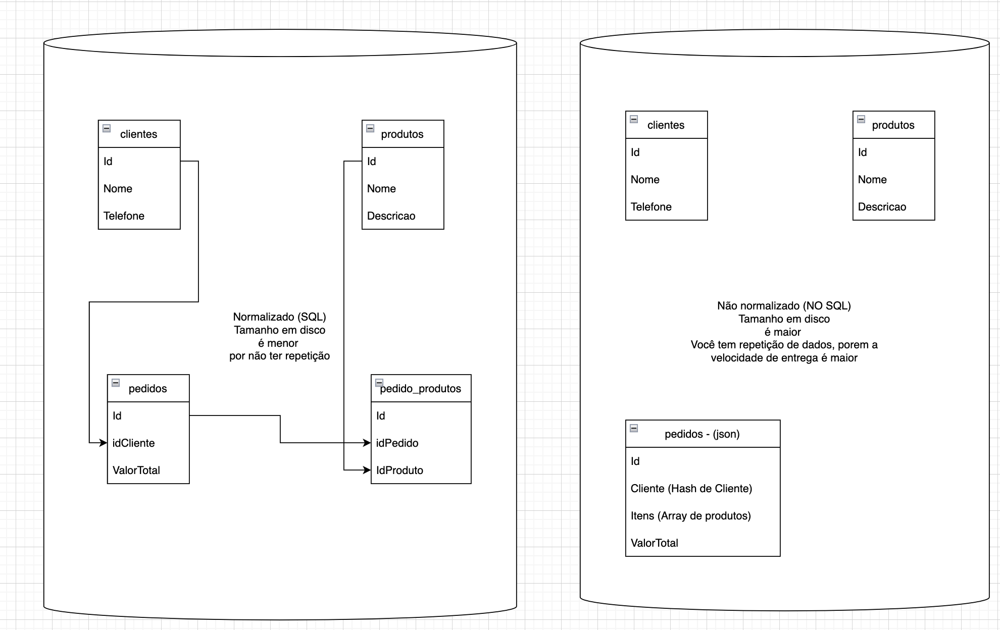

# INTRODUÇÃO A BANCO DE DADOS VOLTADO AO NEGÓCIO - PARTE 2

## Olhando somente para o servidor de Banco de Dados, quando sei se utilizo um BD normalizado ou não normalizado?

- Velocidade
- Volume

## Qual a prioridade da sua empresa? Economia ou velocidade?

- Foco em Economia
    - Usar banco de dados NORMALIZADO (MySQL, PostgreSQL, SQL Server, MariaDB, Oracle, etc)
    - O custo do BD é menor para backup e tamanho em disco
    - A repetição é inimigo, pois aumenta o tamanho dos dados

- Foco em Velocidade
    - Usar banco de dados NÃO NORMALIZADO (MongoDB, Cassandra, CouchDB, HBase, Redis, Firebase, etc)
    - A repetição para ganho de velocidade é válida

## Bancos de dados NORMALIZADOS x NÃO NORMALIZADO
