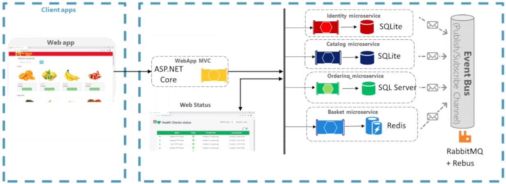
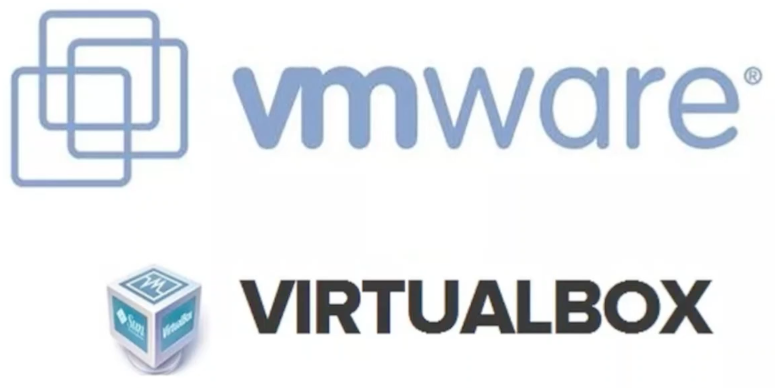
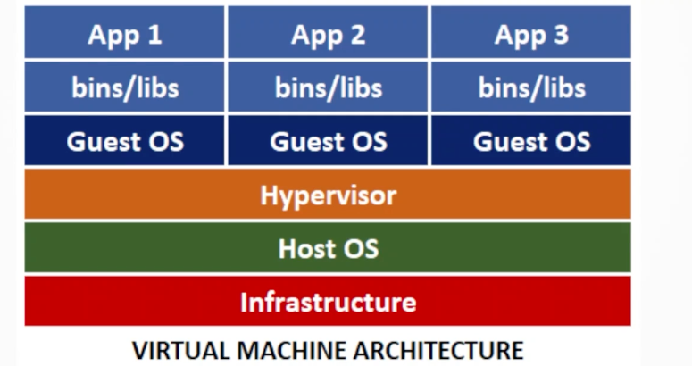
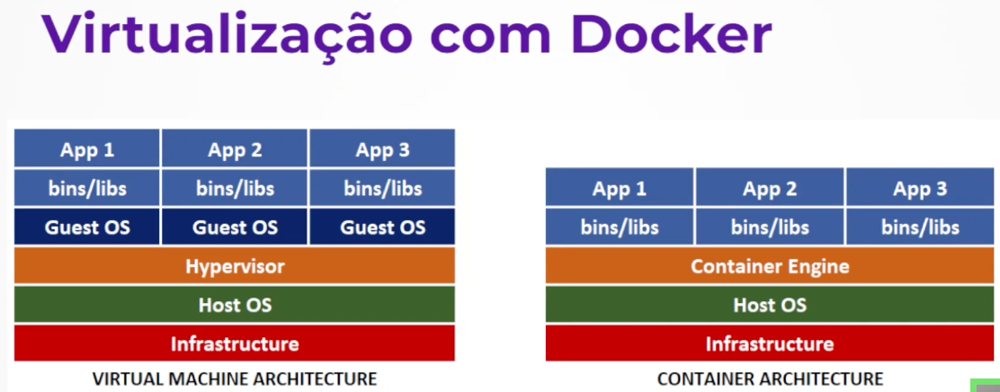

#### Class 12 | Message Brokers and Traceability ID
    -   Presenting RabbitMQ
        -   Presenting Microsservices Project

  

 
        -   Microservice architecture
            -   Reference
                -   https://www.alura.com.br/artigos/microservicos-com-dotnetcore-comunicacao-entre-servicos
<table style="display: flex; justify-content: center; align-items: center; width: 50%;">
    <thead>
        <tr>
            <th>Problem</th>
            <th>Solution</th>
            <th>Explanation</th>
        </tr>
    </thead>
    <tbody>
        <tr>
            <td>In this architecture, each component/service is autonomous and does not know the other</td>
            <td>
                Use a message broker (communication between each service) 
                In our case: RabbitMQ + Rebus (Event Bus)
            </td>
            <td>
                Event Bus is a software artifact that allows the microservices to post notifications (events) that indicate the occurrence of something relevant to other microservices
                 The RabbitMQ + Rebus also allows them to subscribe to (and receive messages from) events
            </td>
        </tr>
    </tbody>
</table>

    -   Message Broker with Rebus and RabbitMQ
    -   Azure Service Bus: Sending Messages to the Queue
        -   Azure Service Bus is a RabbitMQ component
        -   Documentation
            -   https://learn.microsoft.com/en-us/azure/service-bus-messaging/service-bus-dotnet-get-started-with-queues?tabs=passwordless
        -   Install packages
            -   dotnet add package Azure.Messaging.ServiceBus
            -   dotnet add package Azure.Identity
    -   Azure Service Bus: Receiving Queue Messages
        -   Install packages
            -   dotnet add package Azure.Messaging.ServiceBus
            -   dotnet add package Azure.Identity
    -   Virtualization: ASP.NET Core Microservices Project

  
  
  
  
  

 
    -   Traceability ID with Jaeger UI
        -   Documentation
            -   https://www.jaegertracing.io/