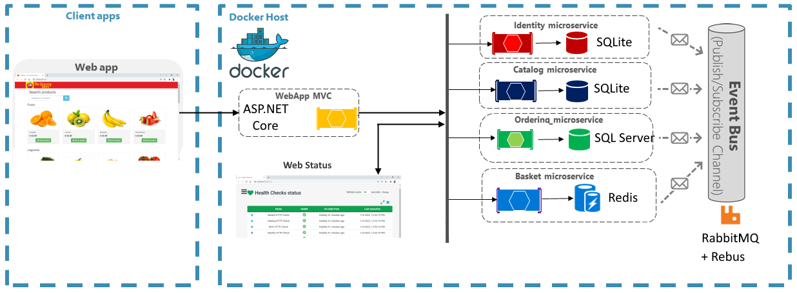

#### Class 13 | Idempotence, Circuit Breaker and Telemetry
    -   Idempotency in commands
        -   Definition
            -   https://xuenqui.medium.com/idempot%C3%AAncia-uma-boa-pr%C3%A1tica-a-se-utilizar-em-servi%C3%A7os-rest-633c38f4d7c0
            -   Command
                -   A request to the system to perform an action that will change the state of the system
                -   Can be accepted or refused
                -   Must be executed only once by a single receiver (unique action)
                -   Obs.: An event can be processed more than once by multiple clients (multiple stakeholders)
                -   Examples of commands (below)
```c#
    namespace Ordering.Commands;
    
    public class CreateOrderCommand : IRequest<bool>
    {
        public CreateOrderCommand() { }

        public CreateOrderCommand(Guid idempotencyId, List<CreateOrderCommand> items)
        {
            IdempotencyId = idempotencyId;
            Items = items;
            // CustomerId = customerId;
            // CustomerName = customerName;
            // CustomerEmail = customerEmail;
            // CustomerPhone = customerPhone;
            // CustomerAddress = customerAddress;
            // CustomerAdditionalCustomer = customerAdditionalCustomer;
            // CustomerDistrict = customerDistrict;
            // CustomerCity = customerCity;
            // CustomerState = customerState;
            // CustomerZipCode = customerZipCode;
        }

        Guid IdempotencyId { get; set; } = default;
        List<CreateOrderCommand> Items { get; set; } = default;
    }
```
    -   Circuit Breaker concept
        -   Documentation
            -   https://learn.microsoft.com/pt-br/dotnet/architecture/microservices/implement-resilient-applications/
    -   Setting Polly for HTTP Requests
        -   Reference
            -   https://www.iteris.com.br/blog/resiliencia-em-aplicacoes-net-core-com-polly/
        -   Polly library
            -   https://github.com/App-vNext/Polly
```c#
    // At MVC.csproj
    <PackageReference Include="Polly" Version="7.2.3" />
    <PackageReference Include="Polly.Extensions.Http" Version="3.0.0" />

    // At Startup.cs
    services.AddHttpClient<IBasketService, BasketService>()
            .AddPolicyHandler(GetRetryPolicy()) //any oscillation will not bring down the app
            .AddPolicyHandler(GetCircuitBreakerPolicy()) //the circuit is opened to interrupt the application (there was a failure)
```
    -   Demonstrating Circuit Breaker and retries with Polly
    -   Presenting Telemetry
        -   Definition
            -   Remote measurement
                -   Data transfer = wireless, optical fiber, electrical network)
                -   Measuring equipment
        -   Reference
            -   https://opentelemetry.io/
<div align = 'center' justify-content = 'space-around'>
  
</div>

```
    -   Using telemetry in ASP.NET Core I
        -   Documentation
            -   https://learn.microsoft.com/en-us/azure/azure-monitor/app/asp-net-core?tabs=netcorenew%2Cnetcore6
        -   Create 2 projects (WebAPI): ServiceA (client), ServiceB (provider)
        -   RestSharp (ServiceA - client)
            -   https://www.nuget.org/packages/RestSharp/109.0.0-preview.1
    -   Using telemetry in ASP.NET Core II
    -   Telemetry: Introduction to Jaeger
        -   Documentation
            -   https://www.jaegertracing.io/
```
<table style="display: flex; justify-content: center; align-items: center; width: 50%;">
    <thead>
        <tr>
            <th>Action Result</th>
            <th>Explanation</th>
        </tr>
    </thead>
    <tbody>
        <tr>
            <td>ViewResult</td>
            <td>represents HTML</td>
        </tr>
        <tr>
            <td>EmptyResult</td>
            <td>it does not represent any result</td>
        </tr>
        <tr>
            <td>RedirectResult</td>
            <td>redirect user to other URL</td>
        </tr>
        <tr>
            <td>JsonResult</td>
            <td>object in JSON notation</td>
        </tr>
        <tr>
            <td>ContentResult</td>
            <td>text result</td>
        </tr>
        <tr>
            <td>FileContentResult</td>
            <td>file to download</td>
        </tr>
    </tbody>
</table>