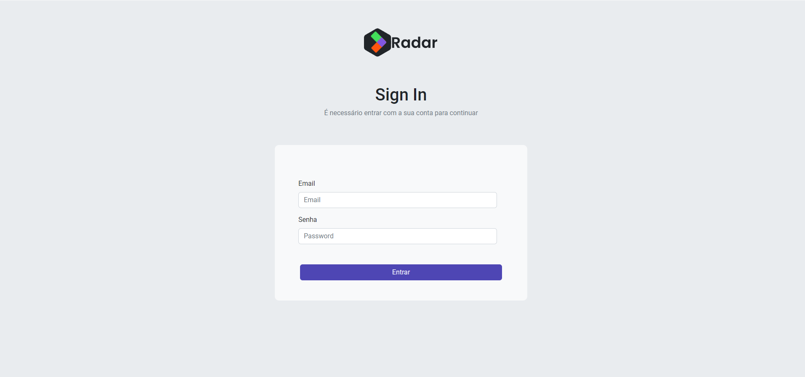
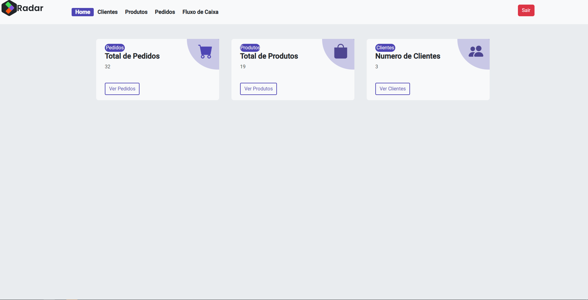
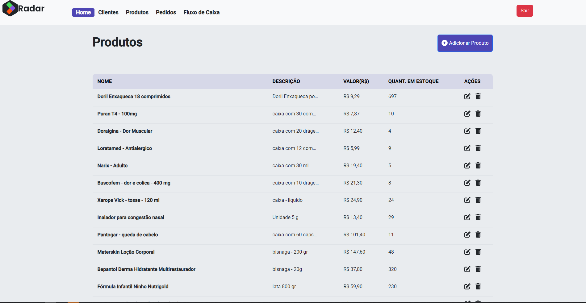
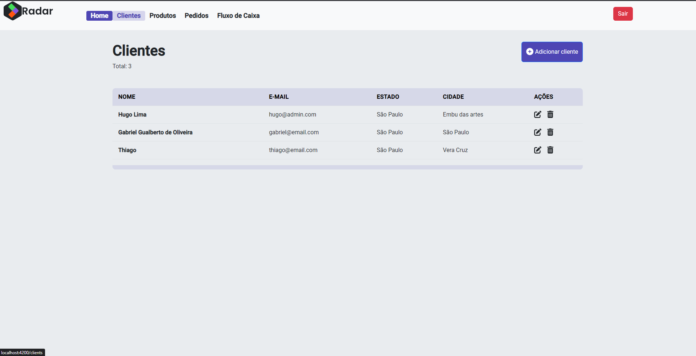
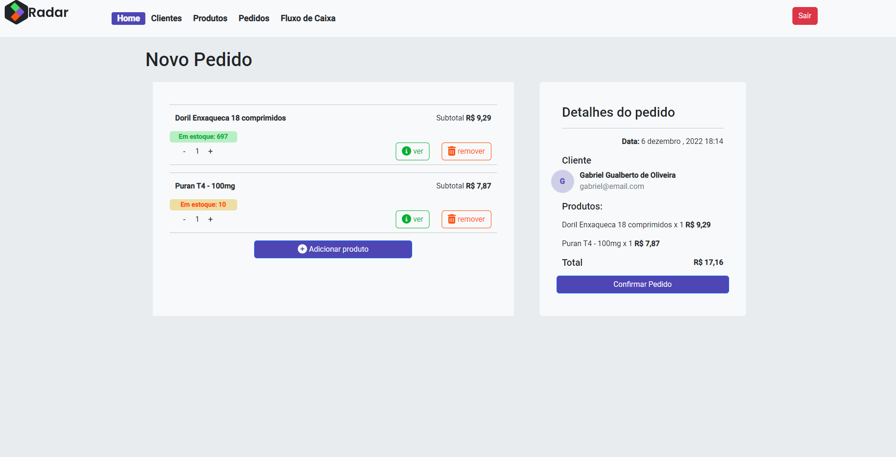
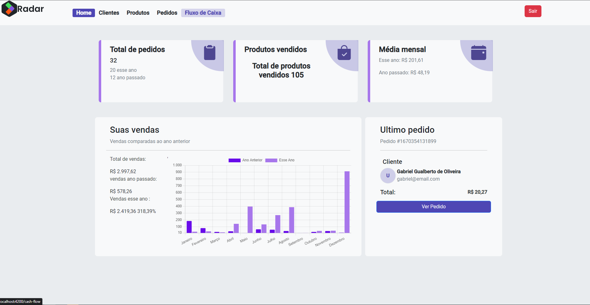
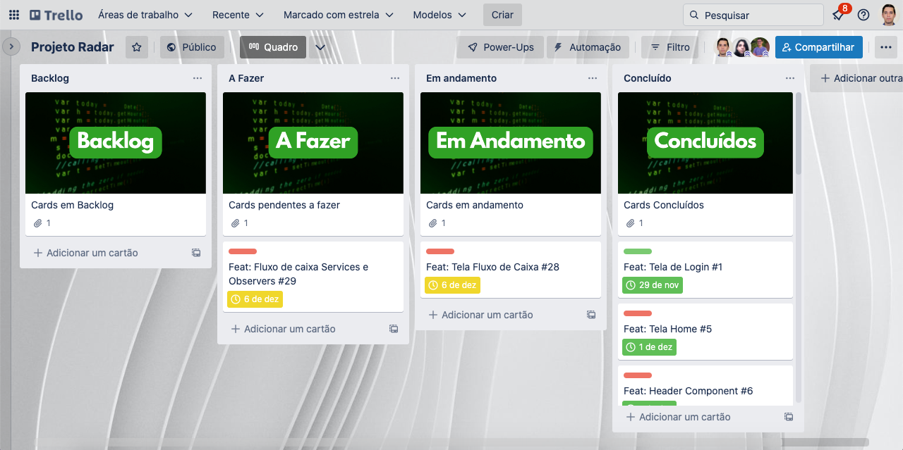

# Desafio Final - Angular (Código do Futuro)
## Grupo 1
### Equipe

| Integrante | Foto | Redes sociais |
| :------------: | :------------: | :------------: |
| Alexandre da Costa Pedro |  |  |
| Gabriel Gualberto de Oliveira |  |  |
| Jonathan Oliveira Avelino |  |  |
| Hugo Nunes |  |  |
| Luís Eduardo |  |  |
| Silvia Helena Souza |  |  |

  <h1> Projeto Radar </h1>

 

<table>
  <thead>
    <tr>
      <th>Descrição da imagem</th>
      <th>Tela</th>
    </tr>
  </thead>
  <tbody>
    <tr>
      <td align = 'center'>Página de login</td>
      <td></td>
    </tr>
    <tr>
      <td align = 'center'>Página Home</td>
      <td></td>
    </tr>
    <tr>
      <td align = 'center'>Página de cadastro de produtos</td>
      <td></td>
    </tr>
    <tr>
      <td align = 'center'>Página cadastro de clientes</td>
      <td></td>
    </tr>
    <tr>
      <td align = 'center'>Página cadastro de pedidos dos clientes</td>
      <td></td>
    </tr>
    <tr>
      <td align = 'center'>Página de fluxo de caixa, mostrando a movimentação do mês</td>
      <td></td>
    </tr>
  </tbody>
</table>

 
 

  <a href="#theproject">O Projeto</a> •
  <a href="#target">Objetivo</a> •
  <a href="#technologies">Tecnologias utilizadas</a> •
  <a href="#development">Desenvolvimento</a> •
  <a href="#howtouse">Como utilizar</a> •
  <a href="#greetings">Agradecimentos</a>

 

<h2> 👨🏻‍💻 O Projeto </h2>

 Nós recebemos o desafio para desenvolver um sistema chamado Radar, o qual possibilita ao lojista fazer o gerenciamento do fluxo de entrada e saída do seu negócio. 

<h2> 💡 Objetivo </h2>

 Desenvolvimento de um sistema chamado Radar, o qual possibilita ao lojista fazer o gerenciamento do fluxo de entrada e saída do seu negócio.

O sistema foi desenvolvido em Angular, com as seguintes funcionalidades:
 
<ul>
  <li>Página de login</li>
  <li>Página home</li>
  <li>Página de cadastro de produtos</li>
  <li>Página cadastro de clientes</li>
  <li>Página cadastro de pedidos dos clientes</li>
  <li>Página de fluxo de caixa, mostrando a movimentação do mês</li>
</ul>

Para gravação das informações, criou-se uma API em Node.js e Express, com a persistência em disco com arquivo.json. Esta API foi integrada à aplicação frontend (Angular).

 

<h2> 🛠 Tecnologias utilizadas </h2>
As seguintes tecnologias foram utilizadas para construção do projeto:  

|                       Descrição                       |           Ferramenta           |            Referência            |
| :----------------------------------------------: | :-----------------------: | :-------------------------------: |
|                       IDE                        |          VS CODE          |  https://code.visualstudio.com/                |
|        Ferramenta de Design de Interface         | FIGMA (Protótipo - UX/UI) |      https://www.figma.com/                |
|   Linguagem de programação (Backend, Frontend)   |        JAVASCRIPT         |  https://developer.mozilla.org/en-US/docs/Web/JavaScript/                |
|        Linguagem de programação (Frontend)       |        TYPESCRIPT         |  https://www.typescriptlang.org/                |
|           API e serviços backend (Backend)       |          NODE.JS          |        https://nodejs.org/                |
|   Framework de aplicação web Node.js (Backend)   |        EXPRESS.JS         |        https://expressjs.com/                |
|          Framework JavaScript (Frontend)         |          ANGULAR          |       https://angular.io/                |
|            Framework de CSS (Frontend)           |         BOOTSTRAP         |       https://getbootstrap.com/                |
|    Biblioteca de Componentes gráficos (UX/UI)     |        FONT AWESOME       |    https://fontawesome.com/                |
|             Open source API (Testing)            |          POSTMAN          |      https://www.postman.com/                 |

  <h3>Backend | API</h3>
  
  
   
  <h3>Testing</h3>
  
   
  <h3>IDE</h3>
  
   
  <h3>UX/UI</h3>
  
  
   
  <h3>Frontend</h3>
  
  
  
  
   

 

<h2> 📓 Desenvolvimento </h2>

 ✔️ Metodologias Ágeis:  Para ter uma melhor produtividade no desenvolvimento do projeto foi utilizado a metologia ágil Kaban. Dessa forma, para melhor organização o projeto foi fragmentado em quatro quadros, sendo: 
 
<ul>
  <li><bold>Backlog<bold>: as tarefas que precisam ser cumpridas no decorrer da Sprint</li>
  <li><bold>A Fazer<bold>: as tarefas que ainda serão realizadas</li>
  <li><bold>Em andamento<bold>: as tarefas que já estão sendo desenvolvidas</li>
  <li><bold>Concluído<bold>: as tarefas que foram cumpridas</li>
</ul>

  <a href="https://trello.com/b/xMzUPteQ/projeto-radar" alt="Metodologia Kanban - quadro Trello"> Clique aqui para visualizar os cards.
  </a>
   
  

    
  

<h2>🧪 Como utilizar</h2>
  <ol &nbsp;>
    <li &nbsp;>Configure a IDE - Visual Studio Code</li>
    <li &nbsp;>Clone o repositório
      <ul>
        <li>git clone https://github.com/alexandrecpedro/radar-project.git</li>
      </ul>
    </li>
    <li &nbsp;>Entre no diretório do projeto:
      <ul>
        <li>cd radar-project</li>
      </ul>
    </li>
    <li><b>Testing</b>
      <ul>
        <li &nbsp;><u>Backend</u>
          <ol>
            <li &nbsp;>Entre no diretório backend
              <ul>
                <li>cd backend</li>
              </ul>
            </li>
            <li &nbsp;>Instale as dependências
              <ul>
                <li>npm install</li>
              </ul>
            </li>
            <li &nbsp;>Run
              <ul>
                <li>npm run dev</li>
              </ul>
            </li>
          </ol>
        </li>
        <li &nbsp;><u>Frontend</u>
          <ol>
            <li &nbsp;>Entre no diretório frontend
              <ul>
                <li>cd frontend</li>
              </ul>
            </li>
            <li &nbsp;>Instale as dependências
              <ul>
                <li>npm install</li>
              </ul>
            </li>
            <li &nbsp;>Run
              <ul>
                <li>ng serve</li>
              </ul>
            </li>
          </ol>
        </li>
      </ul>
    </li>
  </ol>

<h2> 🤝 Agradecimentos </h2>

 Agradecemos à Febrafar/Farmarcas pela oportunidade de participarmos desta bela iniciativa que é o programa de treinamento Código do Futuro, que proporciona a ampliação de conhecimentos e de qualificação na área de desenvolvimento Full Stack - Frontend e Backend (Angular, C#/DotNet). 

